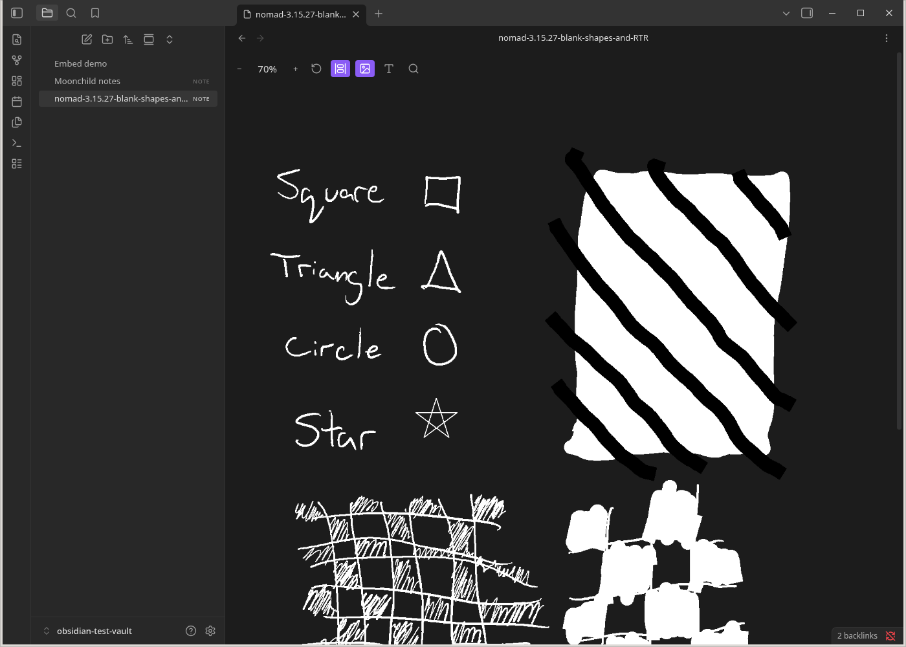
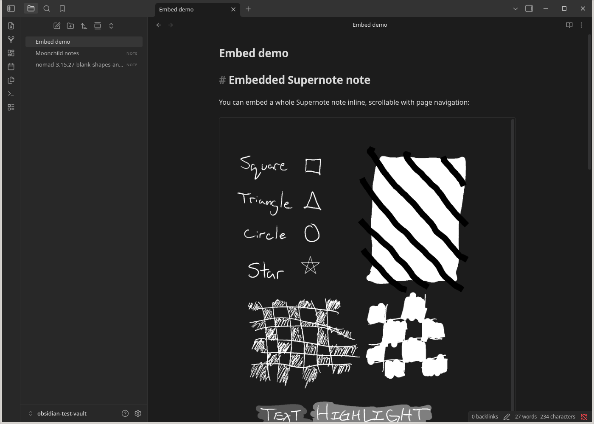
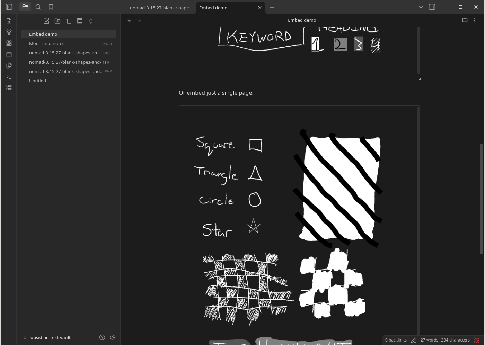
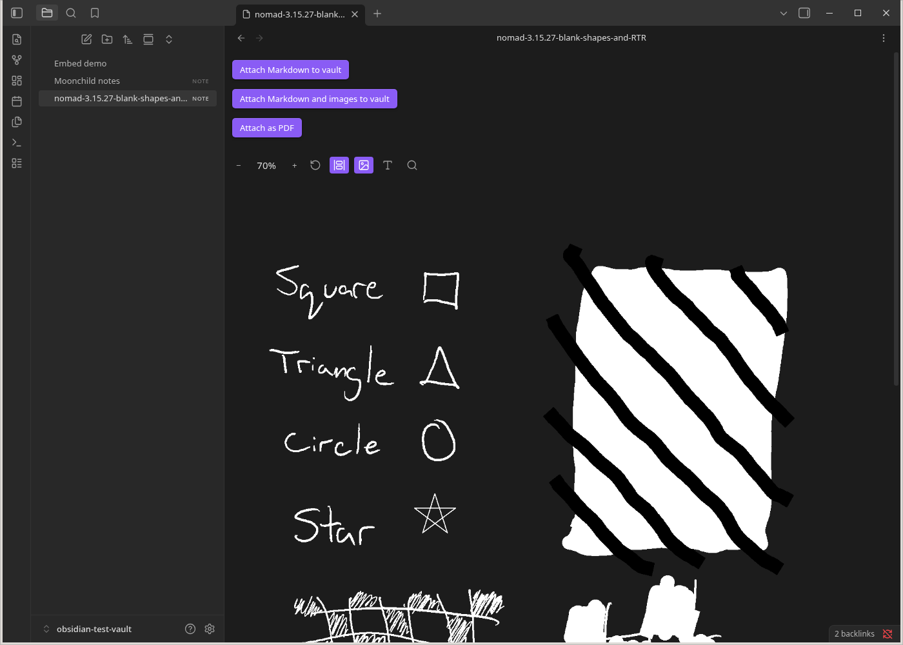
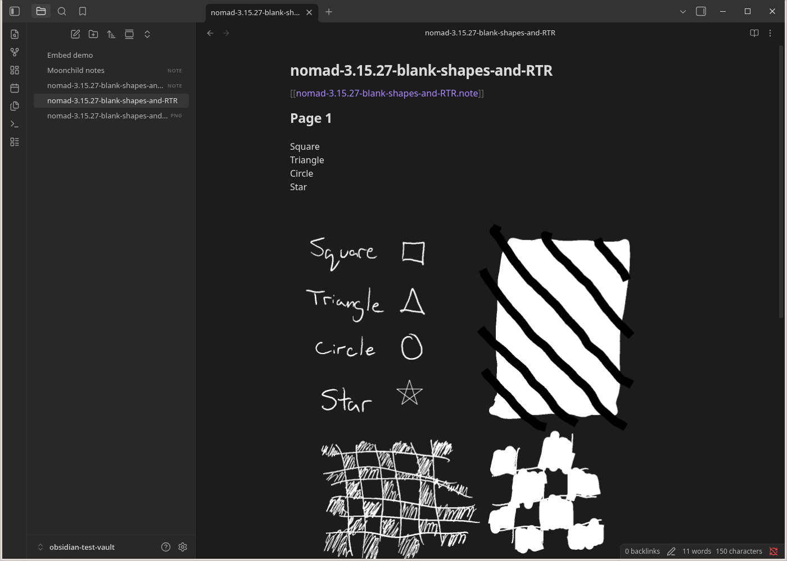
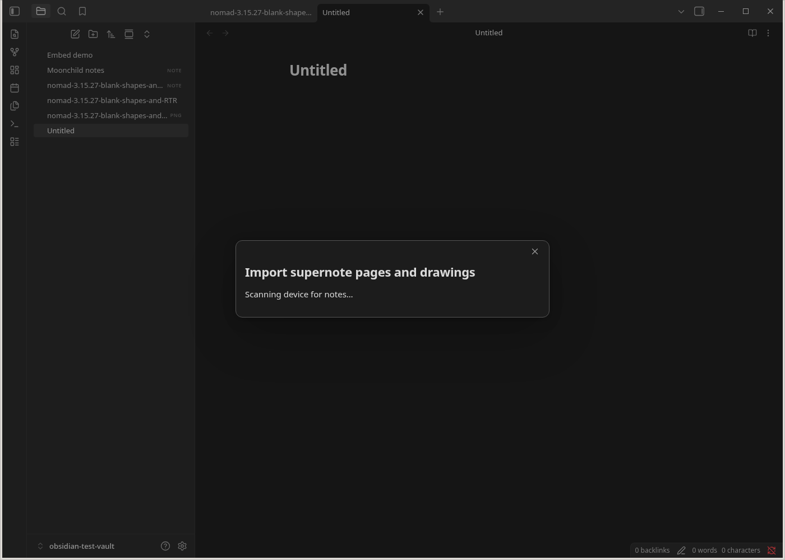
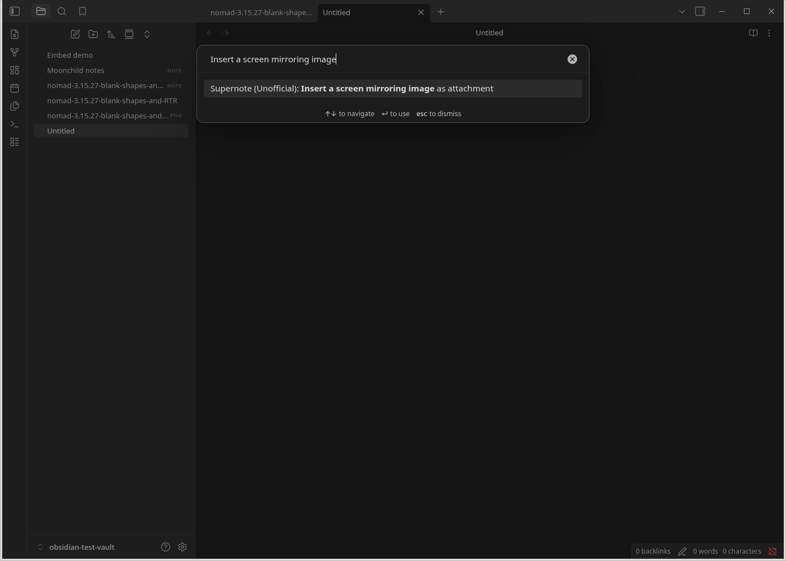
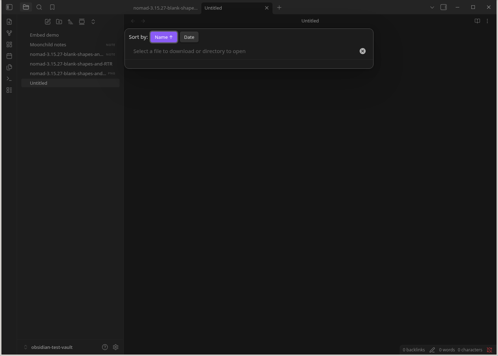
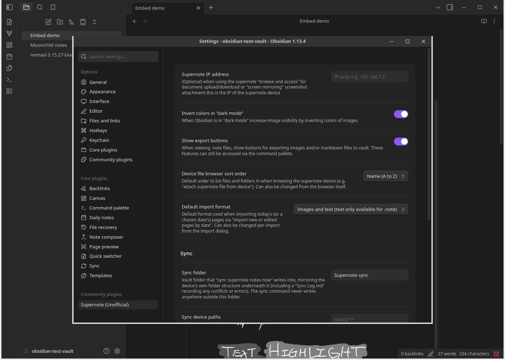

# Screenshot Gallery

A visual tour of this plugin's main features, using the
[`nomad-3.15.27-blank-shapes-and-RTR.note`](supernote-typescript/tests/input/nomad-3.15.27-blank-shapes-and-RTR.note)
sample note from the `supernote-typescript` submodule (shapes, checkboxes,
grids, highlighted text, and headings drawn by hand, then run through
Supernote's on-device recognition).

## 📝 View `*.note` files in your vault

Open a `.note` file like any other note. Pages render as images, with zoom
and page controls in the toolbar.

## 🔗 Embed notes inline

Embed a whole note — scrollable, with page navigation — with
`![[example.note]]`:

Or embed just one page with `![[example.note#page=2]]`:

## ➡️ Export as PNGs and/or Markdown

Enable "Show export buttons" in settings (or use the command palette) to
export a note's pages as PNG images, a Markdown file, or a PDF, attached
directly to your vault:

The exported Markdown includes the recognized handwritten text alongside the
page image:

## 🧠 Import today's notes

The "Import notes edited today" command connects to your Supernote over
Wi-Fi and pulls in everything modified today, attaching it to the current
note — handy paired with [daily notes](https://obsidian.md/help/plugins/daily-notes):

## 📺 Insert a screen mirroring image

Copy an image straight from a [screen-mirrored](https://support.supernote.com/en_US/organizing-managing/1791924-screen-mirroring)
Supernote into the current note with one command:

## ⬇️⬆️ Browse & Access: download and upload

Browse your Supernote's file system directly from Obsidian to download files
into your vault or upload files to the device — or use the sync command to
mirror everything at once:

## ✏️ Extensible OCR and device settings

Device connection, sync, and export preferences all live in one settings
pane. The recognized-text pipeline shown in the export above is extensible
too — build a companion plugin with `registerPageTextProcessor` to customize
OCR output during conversion to Markdown; see [`ocr-plugins.md`](ocr-plugins.md)
(**beta**).

